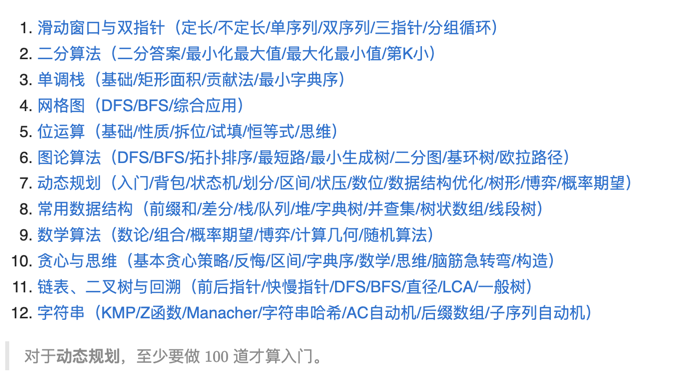

[科学刷题](https://leetcode.cn/circle/discuss/RvFUtj/)  
  
目前二分算法-基础篇第 1 章 第 1 节 第 1 题 (题号: 34)
### 滑动窗口
- 求子数组 - 越长越合法
    ```txt
    一般要写 ans += left。
    内层循环结束后，[left,right] 这个子数组是不满足题目要求的，但在退出循环之前的最后一轮循环，[left−1,right] 是满足题目要求的。由于子数组越长，越能满足题目要求，所以除了 [left−1,right]，还有 [left−2,right],[left−3,right],…,[0,right] 都是满足要求的。也就是说，当右端点固定在 right 时，左端点在 0,1,2,…,left−1 的所有子数组都是满足要求的，这一共有 left 个。
    ```
- 求子数组 - 越短越合法
    ```txt
    一般要写 ans += right - left + 1。
    内层循环结束后，[left,right] 这个子数组是满足题目要求的。由于子数组越短，越能满足题目要求，所以除了 [left,right]，还有 [left+1,right],[left+2,right],…,[right,right] 都是满足要求的。也就是说，当右端点固定在 right 时，左端点在 left,left+1,left+2,…,right 的所有子数组都是满足要求的，这一共有 right−left+1 个。
    ```
- 求子数组 - 恰好型滑动窗口
    ```txt
    例如，要计算有多少个元素和恰好等于 k 的子数组，可以把问题变成：

    计算有多少个元素和 ≥k 的子数组。
    计算有多少个元素和 >k，也就是 ≥k+1 的子数组。
    答案就是元素和 ≥k 的子数组个数，减去元素和 ≥k+1 的子数组个数。这里把 > 转换成 ≥，从而可以把滑窗逻辑封装成一个函数 f，然后用 f(k) - f(k + 1) 计算，无需编写两份滑窗代码。

    总结：「恰好」可以拆分成两个「至少」，也就是两个「越长越合法」的滑窗问题。

    注：也可以把问题变成 ≤k 减去 ≤k−1（两个至多）。可根据题目选择合适的变形方式。
    注：也可以把两个滑动窗口合并起来，维护同一个右端点 right 和两个左端点 left1 和 left 2 ，我把这种写法叫做三指针滑动窗口。
    ```